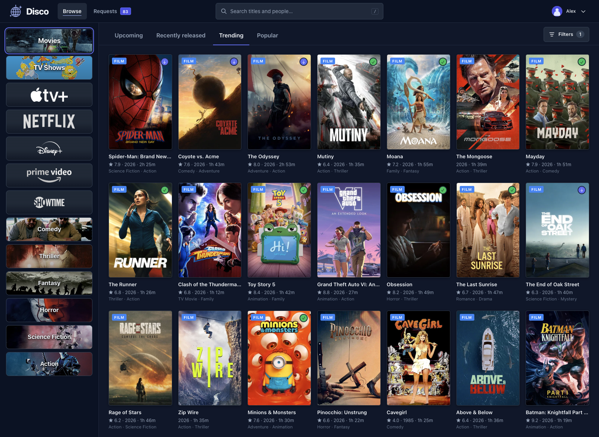

<p align="center">
  
</p>

<h1 align="center">Disco</h1>

<p align="center">
  <strong>Find your next film or series.</strong><br>
  A personal media browser for your Seerr and Plex setup.
</p>

<p align="center">
  <a href="docs/setup.md">Get started</a> ·
  <a href="docs/development.md">Development</a> ·
  <a href="LICENSE">MIT licence</a>
</p>



Disco puts you in control of what you browse. Build a sidebar around your favourite streaming
services, studios, genres, and languages, then find something worth watching. Your existing
[Seerr](https://github.com/seerr-team/seerr) instance handles accounts, metadata, and requests
through to Radarr, Sonarr, and Plex.

## Features

- Save and reorder views for the services, networks, studios, and genres you follow.
- Browse upcoming, recently released, trending, and popular titles with filters for your tastes.
- Hide titles already in Plex and check availability at a glance.
- Explore ratings, cast, seasons, and where to watch in your region.
- Request films or individual seasons, follow their progress, and manage your Seerr watchlist.

## Get started

You need Docker Compose, a running Seerr instance, and an existing Seerr account.
Save this as `compose.yaml`:

```yaml
services:
  disco:
    image: ghcr.io/jameswyse/disco:latest
    container_name: disco
    restart: unless-stopped
    ports:
      - "8785:3000"
    environment:
      SEERR_URL: "http://your-seerr-host:5055"
      SEERR_API_KEY: "your-seerr-api-key"
    volumes:
      - disco-data:/data

volumes:
  disco-data:
```

Replace `SEERR_URL` with a Seerr address reachable from the container, and `SEERR_API_KEY` with
the key from Seerr's **Settings → General → API Key**. Then start Disco:

```sh
docker compose up --detach --pull always
```

Open [localhost:8785](http://localhost:8785), or your server's address on port `8785`, and sign in
with your Seerr account. The image supports AMD64 and ARM64.

Run the same command to update to the latest stable release. Keep the `disco-data` volume to preserve
saved views and preferences. To pin a version, replace `:latest` in the image with an exact tag
such as `:1.0.0`.

See the [setup guide](docs/setup.md) for updates, storage, and building from source.
See [release instructions](docs/releases.md) for publishing a new version.

## Licence

Disco is available under the [MIT licence](LICENSE).
