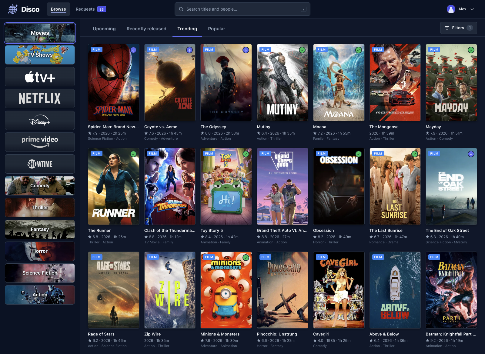

  

<h1 align="center">Disco</h1>

  <strong>Find your next film or series.</strong> 
  A personal media browser for your Seerr and Plex setup.

  <a href="docs/setup.md">Get started</a> ·
  <a href="docs/development.md">Development</a> ·
  <a href="LICENSE">MIT licence</a>

Build a sidebar around your favourite streaming services, studios, genres, and languages.
Your existing [Seerr](https://github.com/seerr-team/seerr) instance handles accounts, metadata,
and requests through to Radarr, Sonarr, and Plex.

Follow the [setup guide](docs/setup.md) to run Disco with Docker Compose or from source.
Maintainers can use the [release guide](docs/releases.md) to publish a version.
